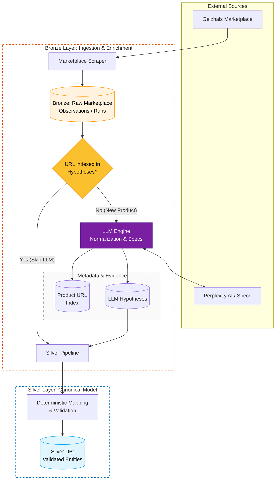

# GPU BD PoC: LLM-Powered Data Structuring

This is a Proof of Concept (PoC) designed to demonstrate how to transform chaotic, unstructured hardware data into a clean, enriched, and actionable data model using LLMs and a modern data architecture.

## PoC Objectives
- Intelligent Structuring: Scraping unstructured sources and using LLMs (Perplexity/GPT) to normalize and enrich technical information (e.g., extracting GPU variants from complex text strings).
- Medallion Architecture: Implementing a three-layer data pipeline to ensure traceability and data quality.

## Data Architecture (Medallion)
The project implements a local-first flow on SQLite:

- Bronze Layer (Raw): Stores raw evidence (market observations) and LLM-generated hypotheses.
- Silver Layer (Canonical): Clean, deterministic model. Validated entities live here (chips, board partner variants).
- Gold Layer (Analytics): Derived views optimized for final consumption (e.g., current price comparisons).

## ⚠️ Important Notes and Ethics
- Use of AI: The included data has been partially generated/enriched with AI. LLM hypotheses are treated as evidence, not absolute canonical truth.
- Responsible Scraping:
  - This project is for personal and educational use, not commercial.
  - Scripts include intentional delays to minimize impact on Geizhals servers.
  - Do not run the scraper indiscriminately. Always respect the terms of service and robots.txt.

## Quick Setup
Requirements: Python 3.10+, SQLite, and make.

```bash
# Initializes the environment, database, and loads sample data
make init
```

The `make init` command automates:
- Creating the venv and installing dependencies.
- Applying database migrations.
- Loading Seeds (pre-generated data) so you can try the project without scraping immediately.

## Pipeline Execution
If you want to run the processes manually or configure your own API:

1. LLM Enrichment
   Copy the example file and add your API Key to enable the inference engine:

```bash
cp .env.example .env
# Edit .env with your PERPLEXITY_API_KEY
```

2. Manual Flows

Bronze (Ingest + LLM):
> Note: Make sure you have created a virtual environment and installed dependencies before running the pipelines.

```bash
python -m src.pipelines.bronze_gpu_pipeline --pages 1 2
```

Silver (Processing):
```bash
python -m src.pipelines.silver_gpu_pipeline --db-path db/pcbuilder.db
```

> Important: The Bronze pipeline scraper will likely break over time. It works today, but there is no guarantee it will keep working as sites change.

## Project Structure
- `/domain/gpu/`: Business logic and hardware-specific data models.
- `/src/pipelines/`: Orchestration of the Bronze and Silver layers.
- `/db/`: SQL schemas and local database.


## Pipeline Diagram


## Analysis and Use Cases (Data Insights)
Once data has been processed through the Bronze and Silver layers, the Gold layer enables advanced analysis for decision-making. Here are some examples of what you can extract from the database:

### 1. Best Power/Price Ratio by Segment
This query identifies the leading GPUs in economic efficiency (performance per euro invested), categorized by user budget.

```sql
WITH MarketSegments AS (
    SELECT 
        model, vendor_id, price_eur, performance_per_euro_score,
        CASE 
            WHEN price_eur < 400 THEN 'Budget (<400€)'
            WHEN price_eur BETWEEN 400 AND 800 THEN 'Mid-Range (400-800€)'
            ELSE 'High-End (>800€)'
        END AS price_segment
    FROM gold_gpu_price_performance
)
SELECT price_segment, model, price_eur, performance_per_euro_score,
       RANK() OVER (PARTITION BY price_segment ORDER BY performance_per_euro_score DESC) as rank
FROM MarketSegments
WHERE rank <= 3;
```

#### Top Picks by Budget

| Segmento | Modelo | Precio | Score Eficiencia |
| --- | --- | --- | --- |
| Budget | GeForce RTX 5060 | 277.38€ | 346.10 |
| Mid-Range | GeForce RTX 5070 | 519.00€ | 297.14 |
| High-End | GeForce RTX 5080 | 1029.00€ | 273.76 |

### 2. VRAM Efficiency for Artificial Intelligence
For AI workloads, the amount of VRAM available per watt consumed (TDP) is critical. This query cross-references chip technical data with market metrics.

```sql
SELECT 
    ai.model,
    ai.vram_gb,
    chip.tdp_watts,
    ROUND((ai.vram_gb * 1024.0) / chip.tdp_watts, 2) AS vram_mb_per_watt
FROM gold_gpu_ai_suitability ai
JOIN gpu_chip chip ON ai.model LIKE (chip.brand_series || ' ' || chip.model_name || '%')
WHERE ai.vram_gb >= 16
ORDER BY vram_mb_per_watt DESC LIMIT 5;
```

#### Energy Efficiency in AI

| Model | VRAM | TDP | MB of VRAM per Watt |
| --- | --- | --- | --- |
| RTX 5060 Ti 16GB | 16 GB | 145W | 112.99 |
| RTX 4070 Ti Super | 16 GB | 200W | 81.92 |
| Radeon RX 7900 XTX | 24 GB | 315W | 78.02 |
| Radeon RX 9070 XT | 16 GB | 230W | 71.23 |

Note: The data shown are examples generated during the PoC to demonstrate the model structure.

## License & Disclaimer
This project is licensed under the Apache License 2.0. 

**Disclaimer:** This software is provided "as is" for educational purposes. 
The developers are not responsible for any misuse of the scraping tools or 
breaches of third-party Terms of Service. Use responsibly.
