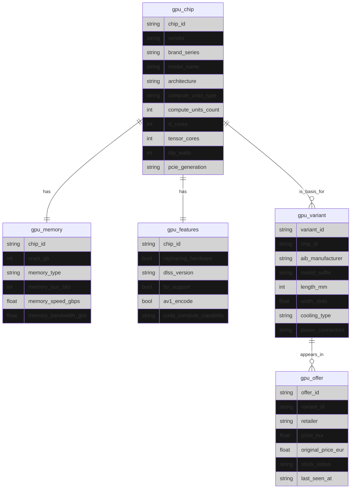

# Documentación de Capa Silver: Dominio GPU

Este documento define el modelo de datos normalizado (3NF) para GPUs en la capa Silver del sistema PcBuilder.

La capa Silver representa la fuente de verdad estructural, desacoplada de retailers, precios y ruido de scraping.
Su objetivo es servir como base estable para:

- Capa Gold (configuraciones óptimas)
- Algoritmos deterministas de selección
- Razonamiento LLM con contexto fiable

## Principios de Diseño (Silver)

- Normalización estricta: una entidad = un concepto del dominio.
- Separación semántica:
  - Chip ≠ Variante ≠ Oferta
- Estabilidad temporal:
  - El chip y sus capacidades no dependen del mercado.
  - El precio y stock son efímeros.
- Trazabilidad:
  - Cada fila Silver debe ser rastreable a Bronze.
- SQL-first:
  - El esquema Silver es independiente de LLMs, UIs o scrapers.

## Diagrama de Entidad-Relación

Nota: el diagrama es representación visual, no contrato físico SQL.

## Definición Canónica de Entidades

### gpu_chip

Representa el silicio base diseñado por el fabricante (NVIDIA / AMD).

Clave primaria: chip_id

Inmutable en el tiempo

Ejemplo: AD104, GA102, NAVI31

Responsabilidades:

- Arquitectura
- Unidades de cómputo
- Capacidades base del chip

### gpu_memory

Describe el subsistema de memoria del chip.

Relación 1:1 con gpu_chip

No depende del ensamblador

Define límites físicos del chip

### gpu_features

Capacidades funcionales del chip.

Relación 1:1 con gpu_chip

Flags técnicos (ray tracing, AV1, DLSS/FSR)

Usado intensivamente por reglas Gold y razonamiento LLM

### gpu_variant

Representa una implementación comercial del chip por un AIB (ASUS, MSI, Gigabyte...).

Relación N:1 con gpu_chip

Afecta a:

- Dimensiones físicas
- Refrigeración
- Conectores de energía

Ejemplo:

- RTX 4070 Ti Gaming OC
- RTX 4070 Ti Ventus 2X

### gpu_offer

Instancia de mercado de una variante concreta.

Relación N:1 con gpu_variant

Entidad volátil

Puede desaparecer o cambiar de precio

Incluye:

- Precio actual
- Precio original
- Estado de stock
- Última detección

## Reglas de Integridad (no visibles en Mermaid)

Estas reglas DEBEN cumplirse en SQL:

- gpu_memory.chip_id → FK a gpu_chip.chip_id
- gpu_features.chip_id → FK a gpu_chip.chip_id
- gpu_variant.chip_id → FK a gpu_chip.chip_id
- gpu_offer.variant_id → FK a gpu_variant.variant_id

## Antipatrones Evitados (a propósito)

- ❌ Mezclar precios con especificaciones
- ❌ Duplicar información del chip en variantes
- ❌ Modelos "flat" dependientes del retailer
- ❌ Campos calculados en Silver

## Relación con Otras Capas

| Capa | Rol |
| --- | --- |
| Bronze | Datos crudos de scrapers |
| Silver | Dominio limpio y normalizado |
| Gold | Configuraciones óptimas, scoring, rankings |

Silver no decide, no optimiza, no recomienda.
Silver define la realidad del dominio.

## Estado del Modelo

- ✔ Normalizado (3NF)
- ✔ Escalable
- ✔ Compatible con SQLite / PostgreSQL
- ✔ Preparado para razonamiento LLM determinista
