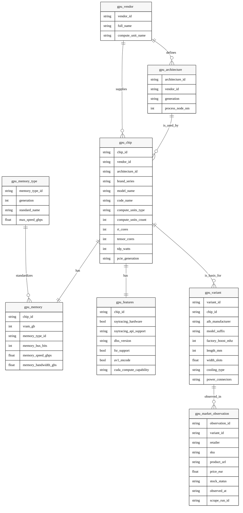

# GPU Silver Model

The Silver layer of the GPU domain represents a selectively normalized and historical view of the GPU market,
combining canonical hardware definitions with immutable external market observations.

This layer is designed to:
- Preserve historical truth
- Normalize stable reference semantics without overengineering volatile naming
- Provide a stable foundation for analytical and decision-making logic

## Conceptual Overview

The GPU Silver model separates the domain into two clearly differentiated concerns:

1. **Canonical GPU definitions**
2. **External market observations**

This separation allows the system to reason about GPUs independently of how retailers
publish, change, or remove product listings over time.

---

---

## Normalization Strategy

The Silver layer uses selective, pragmatic normalization:
- Normalized reference tables: `gpu_vendor`, `gpu_architecture`, `gpu_memory_type`
  (low cardinality, stable semantics, rich metadata, reused across the domain)
- Controlled text fields: `brand_series`, `code_name`, `pcie_generation`, `stock_status`
  (unstable naming, high cardinality, or simple enums without metadata)

This avoids overengineering and improves queryability by keeping volatile naming inline
while preserving stable joins for reference metadata.

## Canonical GPU Definitions

Canonical entities describe **what a GPU is**, independently of where or how it is sold.

These entities are curated and internally controlled. Normalization is applied where
semantics are stable, with controlled text fields for volatile naming.

### GPU Chip

Represents the underlying GPU silicon design.

A chip defines:
- The vendor and architecture (normalized references)
- Compute and acceleration capabilities
- Typical sustained clock frequency via `typical_clock_mhz`
- Power and interface characteristics, including PCIe generation

A chip is the common base for multiple commercial GPU variants.
Product identity fields such as brand_series and code_name remain controlled text to avoid
normalizing unstable naming.

Clock semantics:
- `typical_clock_mhz` represents the typical sustained operating frequency under load.
- It is a vendor-neutral abstraction: AMD Game Clock, NVIDIA Base Clock.
- It is not the minimum guaranteed clock and is not split into base/game/boost triplets.
- This choice maximizes cross-vendor comparability and avoids over-modeling.
- Boost clocks remain modeled separately as peak capability on `gpu_variant.factory_boost_mhz`.

---

### GPU Memory

Represents the memory configuration associated with a GPU chip.

Memory is modeled separately to:
- Capture technical constraints explicitly
- Avoid duplication across variants
- Keep chip definitions focused on compute capabilities

Memory type is normalized via `gpu_memory_type` to reuse stable standards metadata.
Each chip has exactly one memory configuration.

---

### GPU Features

Represents feature-level capabilities exposed by the GPU chip.

This includes hardware support for:
- Ray tracing
- Upscaling technologies
- Encoding formats
- Compute APIs

Features are modeled independently to keep chip definitions concise and evolvable.

Each chip has exactly one feature set.

Capability semantics:
- `tensor_cores` is a capability indicator for dedicated matrix/AI hardware only.
  It does not imply cross-vendor performance equivalence or parity.
- `cuda_compute_capability` is NVIDIA-only by design; NULL values for AMD are semantically correct
  and used for compatibility filtering, not scoring.
- Silver models capabilities, not implementations; detailed architectural equivalence is
  intentionally out of scope.

---

### GPU Variant

`gpu_variant` is a Silver entity that represents a stable physical/commercial configuration
derived from a chip. It is not a retailer SKU and not a market offer.

A variant captures:
- AIB manufacturer and model suffix
- Factory boost/OC and power connectors
- Physical dimensions and cooling characteristics

Multiple variants can be derived from the same chip.
Variants are the atomic unit used for market comparison.
They are created on-demand when processing Bronze market observations using deterministic
resolution logic and are not seed-initialized.

---

## Market Observations

Market data represents **what is observed**, not what is controlled.

This data is inherently unstable and is therefore modeled as immutable events.

### Market Observation

A market observation represents a single point-in-time snapshot of how a GPU variant
appears on an external retailer. Each observation is an immutable point-in-time fact
and always references an existing `gpu_variant`.

An observation captures:
- The retailer context
- The observed price
- The observed stock state
- External identifiers as they existed at that moment

Observations are:
- Append-only
- Never updated or deleted
- The sole source of historical price and availability data

The system does not attempt to maintain a notion of a “current offer” at this layer.
Current state is always derived downstream.

---

## Seeding Policy

Seed-initialized entities:
- `gpu_vendor`
- `gpu_architecture`
- `gpu_memory_type`

Not seed-initialized:
- `gpu_variant`
- `gpu_market_observation`

Rationale: reference entities exist independently of the market, while variants and
observations only exist because the market materializes them.

---

## Relationships and Data Flow

The Silver model enforces a one-way dependency flow:

- Chips define the technical base
- Variants define sellable products
- Observations describe market behavior over time

End-to-end flow:
Bronze (raw offers) -> Silver (canonical chips, derived variants, observations) -> Gold (aggregates)

No Silver entity depends on Gold logic or derived state.

---

## Design Principles

The GPU Silver model follows these principles:

- **Historical truth over convenience**  
  External data is never overwritten.

- **Selective normalization for stable semantics**  
  Low-cardinality reference tables are normalized; volatile naming stays in controlled
  text fields for direct filtering.

- **Event-based modeling for unstable data**  
  Market data is treated as a stream of observations.

- **Clear separation of concerns**  
  Technical definitions and market behavior are modeled independently.

---

## Scope Boundaries

The Silver layer intentionally does not model:
- Chiplet internals (GCD vs MCD)
- Voltage, stepping, or SKU binning
- Base clocks as minimum guaranteed values
- Vendor-specific microarchitectural details

If a detail does not materially affect recommendation outcomes, it is excluded by design.

---

## Non-Goals

The Silver layer does not:
- Determine the “best” price
- Aggregate or rank offers
- Predict future prices
- Contain user-facing logic

All such concerns belong to the Gold layer or higher.
