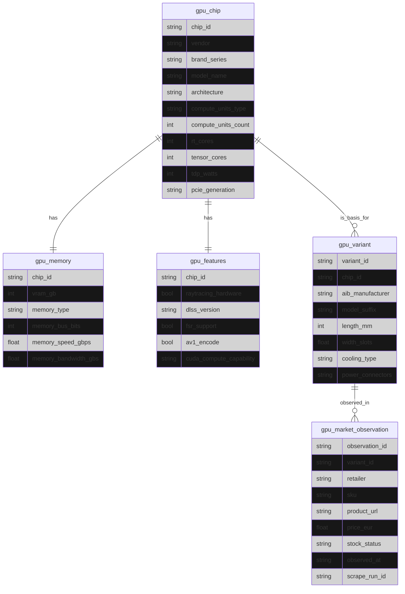

# GPU Silver Model

The Silver layer of the GPU domain represents a normalized and historical view of the GPU market,
combining canonical hardware definitions with immutable external market observations.

This layer is designed to:
- Preserve historical truth
- Normalize unstable external data
- Provide a stable foundation for analytical and decision-making logic

## Conceptual Overview

The GPU Silver model separates the domain into two clearly differentiated concerns:

1. **Canonical GPU definitions**
2. **External market observations**

This separation allows the system to reason about GPUs independently of how retailers
publish, change, or remove product listings over time.

---

---

## Canonical GPU Definitions

Canonical entities describe **what a GPU is**, independently of where or how it is sold.

These entities are stable, normalized, and internally controlled.

### GPU Chip

Represents the underlying GPU silicon design.

A chip defines:
- The vendor and architecture
- Compute and acceleration capabilities
- Power and interface characteristics

A chip is the common base for multiple commercial GPU variants.

---

### GPU Memory

Represents the memory configuration associated with a GPU chip.

Memory is modeled separately to:
- Capture technical constraints explicitly
- Avoid duplication across variants
- Keep chip definitions focused on compute capabilities

Each chip has exactly one memory configuration.

---

### GPU Features

Represents feature-level capabilities exposed by the GPU chip.

This includes hardware support for:
- Ray tracing
- Upscaling technologies
- Encoding formats
- Compute APIs

Features are modeled independently to keep chip definitions concise and evolvable.

Each chip has exactly one feature set.

---

### GPU Variant

Represents a commercial, physical GPU product derived from a chip.

A variant captures:
- Board partner customization
- Physical dimensions
- Cooling and power characteristics

Multiple variants can be derived from the same chip.
Variants are the atomic unit used for market comparison.

---

## Market Observations

Market data represents **what is observed**, not what is controlled.

This data is inherently unstable and is therefore modeled as immutable events.

### Market Observation

A market observation represents a single point-in-time snapshot of how a GPU variant
appears on an external retailer.

An observation captures:
- The retailer context
- The observed price
- The observed stock state
- External identifiers as they existed at that moment

Observations are:
- Append-only
- Never updated or deleted
- The sole source of historical price and availability data

The system does not attempt to maintain a notion of a “current offer” at this layer.
Current state is always derived downstream.

---

## Relationships and Data Flow

The Silver model enforces a one-way dependency flow:

- Chips define the technical base
- Variants define sellable products
- Observations describe market behavior over time

No Silver entity depends on Gold logic or derived state.

---

## Design Principles

The GPU Silver model follows these principles:

- **Historical truth over convenience**  
  External data is never overwritten.

- **Normalization of stable concepts**  
  Chips, features, and variants are controlled internally.

- **Event-based modeling for unstable data**  
  Market data is treated as a stream of observations.

- **Clear separation of concerns**  
  Technical definitions and market behavior are modeled independently.

---

## Non-Goals

The Silver layer does not:
- Determine the “best” price
- Aggregate or rank offers
- Predict future prices
- Contain user-facing logic

All such concerns belong to the Gold layer or higher.
